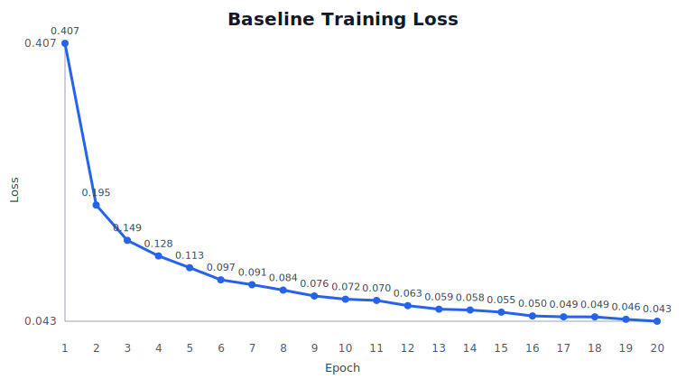
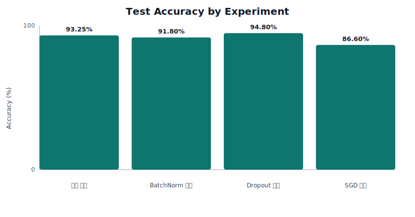
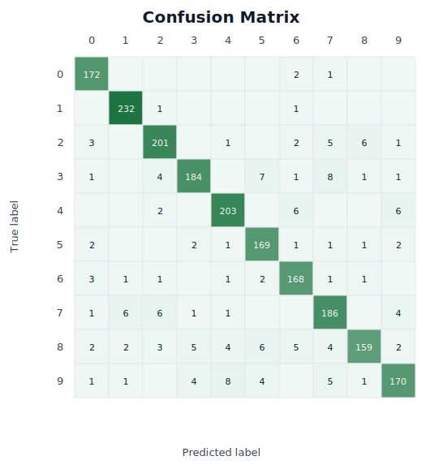
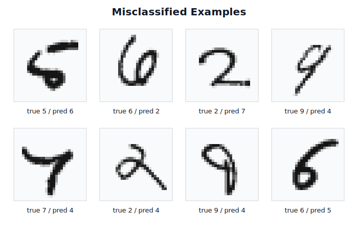

# MNIST 손글씨 숫자 인식 과제 보고서

## 0. 반·팀원

| 항목 | 내용   |
| --- |------|
| 반 | 301반 |
| 팀명 | 2조   |
| 팀원 | 김민철  |
| 팀원 | 김세민  |
| 팀원 | 남동현  |
| 팀원 | 박승현  |

---

## 1. 실험 목적

이번 과제의 목표는 MNIST 손글씨 숫자 이미지를 0부터 9까지 10개의 클래스로 분류하는 신경망을 **NumPy만으로 직접 구현**하는 것이다.

PyTorch나 TensorFlow 같은 딥러닝 프레임워크를 사용하지 않고, 각 레이어의 `forward`, `backward`, 손실 함수, 옵티마이저, 학습 루프를 직접 연결했다.

---

## 2. 모델 구조

기본 모델은 2개의 은닉층을 가진 완전연결 신경망이다.

```text
입력 784
-> Affine(512) -> BatchNorm -> ReLU -> Dropout
-> Affine(256) -> BatchNorm -> ReLU -> Dropout
-> Affine(10) -> Softmax
```

| 구성 요소 | 역할 |
| --- | --- |
| Affine | 입력 벡터를 다음 차원의 점수로 선형 변환 |
| BatchNorm | 배치 단위 평균과 분산으로 feature 분포 안정화 |
| ReLU | 음수 값을 0으로 잘라 비선형성 추가 |
| Dropout | 일부 뉴런 출력을 0으로 만들어 과적합 완화 |
| Softmax | 마지막 10개 logit을 클래스 확률로 변환 |
| Cross Entropy Loss | 정답 클래스 확률을 기준으로 손실 계산 |

총 파라미터 수는 **537,354개**이다.

---

## 3. 구현 내용

구현은 크게 레이어, 손실 함수, 옵티마이저, 네트워크 조립, 학습 루프로 나뉜다.

| 파일 | 구현 내용 |
| --- | --- |
| `activations.py` | ReLU, Softmax |
| `layers.py` | Affine, BatchNorm, Dropout의 forward/backward |
| `losses.py` | Cross Entropy Loss |
| `optimizers.py` | SGD, Adam |
| `network.py` | 전체 신경망 조립, forward/backward 연결 |
| `training.py` | mini-batch 학습 루프 |

학습 흐름은 다음 순서로 진행된다.

```text
forward -> loss 계산 -> backward -> optimizer update
```

특히 Softmax와 Cross Entropy를 함께 사용하면 출력층 gradient가 다음처럼 단순해진다.

```text
gradient = y_pred - y_true_one_hot
```

따라서 `train()`에서는 예측 확률 `y_pred`에서 정답 위치만 1을 빼고, 이 값을 역전파의 시작점으로 사용했다.

---

## 4. 학습 설정

| 항목 | 값 |
| --- | --- |
| 기본 옵티마이저 | Adam |
| 기본 학습률 | 0.001 |
| epochs | 20 |
| batch_size | 128 |
| Dropout 비율 | 0.5 |
| BatchNorm momentum | 0.9 |
| 가중치 초기화 | He initialization |

최종 성능은 전체 MNIST 데이터 기준으로 측정했다.

```text
train 60,000개
test 10,000개
epochs 20
```

---

## 5. 실험 환경

| 항목 | 내용 |
| --- | --- |
| 환경 | Google Colab |
| Python | 3.12.13 |
| 주요 라이브러리 | NumPy 2.3.5 |
| 데이터셋 | MNIST, `data/mnist.npz` |
| 학습 장치 | CPU |
| 외부 딥러닝 프레임워크 | 사용하지 않음 |

---

## 6. 최종 결과

| 항목 | 값 |
| --- | ---: |
| Train Accuracy | 99.81% |
| Test Accuracy | 98.36% |
| Final Loss | 0.0430 |
| 총 파라미터 수 | 537,354 |
| 전체 학습 시간 | 813.1초 |

최종 모델은 테스트 정확도 **98.36%**를 달성했다. 과제 목표였던 97% 이상을 넘겼고, NumPy만으로 구현한 학습 파이프라인이 실제 분류 성능까지 낼 수 있음을 확인했다.

### 6.1 학습 손실 변화



기본 모델의 loss는 다음과 같이 감소했다.

```text
0.4067 -> 0.1951 -> ... -> 0.0456 -> 0.0430
```

loss가 꾸준히 감소했으므로, forward, loss, backward, optimizer update가 정상적으로 연결되어 있음을 확인할 수 있다.

---

## 7. 추가 실험

최종 학습은 전체 데이터로 수행했고, 구조별 차이를 비교하기 위한 추가 실험은 다음 조건으로 수행했다.

```text
train 10,000개
test 2,000개
epochs 5
```



| 실험 | 설정 | Final Loss | Train Accuracy | Test Accuracy | 관찰 |
| --- | --- | ---: | ---: | ---: | --- |
| 기본 모델 | BN + Dropout + Adam | 0.2089 | 97.30% | 93.25% | 가장 안정적 |
| BatchNorm 제거 | Dropout + Adam | 0.2182 | 95.95% | 91.80% | 정확도 하락 |
| Dropout 제거 | BN + Adam | 0.0304 | 99.98% | 94.80% | train 정확도가 매우 높아 과적합 가능성 증가 |
| SGD 사용 | BN + Dropout + SGD | 0.5333 | 90.92% | 86.60% | Adam보다 수렴 속도 느림 |

실험 결과를 보면 BatchNorm을 제거했을 때 정확도가 낮아졌고, SGD는 같은 epoch 수에서 Adam보다 수렴이 느렸다. Dropout을 제거한 경우 train accuracy가 99.98%까지 올라갔기 때문에, 더 긴 학습에서는 과적합 여부를 추가로 확인할 필요가 있다.

### 7.1 오분류 분석

아래 오분류 예시는 추가 실험과 같은 빠른 비교 조건에서 테스트셋 예측이 정답과 달랐던 샘플을 모은 것이다. 최종 모델 성능 수치가 아니라, 어떤 형태의 숫자에서 혼동이 생기는지 확인하기 위한 시각화이다.





| 순서 | 정답 | 예측 |
| --- | ---: | ---: |
| 1 | 5 | 6 |
| 2 | 6 | 2 |
| 3 | 2 | 7 |
| 4 | 9 | 4 |
| 5 | 7 | 4 |
| 6 | 2 | 4 |
| 7 | 9 | 4 |
| 8 | 6 | 5 |

오분류 예시를 보면 4와 9처럼 획의 모양이 비슷하거나, 2와 7처럼 일부 획이 흐릿한 경우에서 혼동이 발생했다.

---

## 8. 회고

처음에는 `loss` 값이 실제 업데이트에 사용되지 않는 줄 알았다. 코드에서 `loss`는 `loss_history`에 저장만 하고, 역전파에 넘기는 `dout`은 `train()` 함수 안에서 따로 만들고 있었기 때문이다.

하지만 확인해보니 `loss`를 사용하지 않는 것이 아니라, Softmax와 Cross Entropy의 미분 결과가 합쳐져 있어서 그렇게 보이는 것이었다. 두 함수를 함께 미분하면 출력층의 gradient가 `(y_pred - y_true_one_hot) / batch_size`로 단순해진다. 그래서 이번 코드에서는 이 값을 `dout`으로 직접 만들어 `backward()`에 넘긴다.

그 이후 각 레이어가 `dW`, `db` 같은 gradient를 계산하고, optimizer가 그 값을 이용해 실제 `W`, `b`를 업데이트한다. 즉 `loss`는 학습 상태를 확인하는 값으로 저장되고, 실제 학습은 그 loss에서 나온 미분값인 gradient를 통해 진행된다는 점을 이해할 수 있었다.

